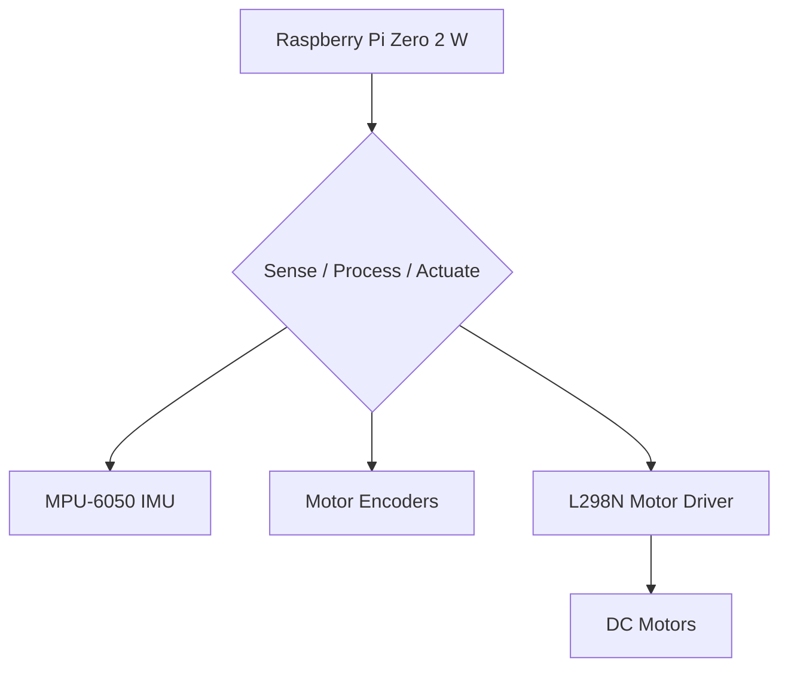

## **Project: E.M.B.E.R. (Equilibrium Maintaining Bi-wheeled Electronic Robot)**

A Build Log for a Self-Balancing Robot

#### **The Challenge**

Building a two-wheeled, self-balancing robot is a classic robotics challenge. The whole game is solving the "inverted pendulum" problem: how to create a control system that can react fast enough to keep the robot from falling on its face. It’s a great test of both hardware integration and software control.

-----

#### **The Plan**

This is my take on it: a robot built around a **Raspberry Pi Zero 2 W** and programmed in **C++** for speed. It uses a feedback loop from an IMU (Inertial Measurement Unit) and motor encoders to stay upright.

My goals for this build were simple:

  * Build a stable two-wheeled chassis.
  * Implement a solid **PID control loop** in C++.
  * Integrate the necessary sensors for balance and motor feedback.
  * Design a simple, portable power system.
  * Create a base platform I can add more features to later.

-----

#### **The Architecture**

The system runs on a continuous "sense, process, actuate" loop.

  * **Sense:** The **MPU-6050 IMU** provides the robot's current angle and rate of tilt. **Motor encoders** report how fast the wheels are actually spinning.
  * **Process:** The Raspberry Pi reads all this sensor data and feeds it into the PID control algorithm. The algorithm calculates the necessary motor speed to correct any tilt.
  * **Actuate:** The Pi sends PWM (Pulse Width Modulation) signals to the **L298N Motor Driver**, which adjusts the power to the DC motors.

<!-- end list -->

-----

#### **The Parts List (Bill of Materials)**

This is everything you need to build the core robot.

| Qty | Component                       | Notes                                    |
|:--- |:------------------------------- |:---------------------------------------- |
| 1   | Raspberry Pi Zero 2 W           | The brain of the operation.              |
| 2   | 3.7V 2000mAh LiPo Batteries     | Connected in series for 7.4V.            |
| 1   | LM2996 DC-DC Buck Converter     | Steps the 7.4V down to a stable 5V for the Pi. |
| 1   | MPU-6050 IMU Module             | Gyroscope & Accelerometer.               |
| 2   | TT DC Geared Motors with Encoders | The motors and their feedback sensors.   |
| 2   | Wheels                          | To match the TT motors.                  |
| 1   | L298N Dual H-Bridge Motor Driver| Controls the motors.                     |
| 1   | Custom 3D-Printed Chassis       | The robot's frame.                       |
| -   | Wires, Resistors, Switch        | The usual supporting cast.               |

-----

#### **Power & Wiring**

  * **Motor Power:** The **7.4V** from the two LiPo batteries wired in series goes directly to the L298N motor driver. DC motors are thirsty.
  * **5V Rail:** The 7.4V line also goes to the **LM2996 buck converter**, which creates the stable **5V** rail needed to power the Raspberry Pi and other logic components.
  * **3.3V Rail:** The Pi's onboard regulator provides the **3.3V** needed by the MPU-6050 IMU.
  * **Signals:** The Pi communicates with the MPU-6050 over **I2C** and sends **PWM** signals to the L298N to control motor speed. It reads the wheel speed from the encoder pins.

-----

#### **The Brains (The Software)**

  * **Dev Environment:** I'm using **Raspberry Pi OS Lite** (no desktop), Visual Studio Code with remote SSH, and **C++** (compiled with g++ via CMake). I'm using the **pigpio** library for fast, low-level GPIO control, which is critical for reading the encoders accurately.
  * **The Control Loop:** The core of the program is a high-frequency loop (I'm targeting 50-100Hz). In each cycle, it:
    1.  Reads the current tilt angle from the IMU.
    2.  Feeds that angle into the PID controller.
    3.  The PID algorithm spits out a correction value.
    4.  This value is used to set the new speed for the motors.
    5.  Repeat. Fast.

-----

#### **The Magic Sauce: PID Control**

This is the algorithm that makes balancing possible. If you're new to it, here's the simple version:

`output = (P * current_error) + (I * total_error) + (D * error_rate)`

  * **Proportional (P): The Push.** This looks at the current tilt angle (the error) and pushes back proportionally. If it's leaning a lot, it pushes hard. If it's leaning a little, it pushes gently.
  * **Derivative (D): The Brake.** This looks at how *fast* the robot is tilting. If it's falling quickly, the D term applies a strong counter-force to dampen the fall and prevent overshooting. It stops the oscillations.
  * **Integral (I): The Trim.** This looks at the accumulated error over time. If the robot has a tiny, persistent lean (e.g., because the weight isn't perfectly centered), the I term will slowly build up and apply a correction to make it stand perfectly straight.

-----

#### **Testing & Tuning**

**Perfect is the imaginary friend of never shipped**, and you'll never get a PID controller right on the first try.

1.  **Test the power.** Before plugging in the Pi, use a multimeter to make sure your buck converter is actually outputting a stable 5V.
2.  **Test each component.** Write tiny test scripts to make sure the motors spin, the IMU gives you data, etc.
3.  **Tune the PID.** This is the real work.
      * Set I and D to zero and hold the robot upright.
      * Slowly increase the **P** value until the robot starts to oscillate or shake aggressively when it tries to balance.
      * Slowly increase the **D** value to act as a brake, dampening the oscillations until it's stable.
      * Finally, add a very small **I** value to correct any long-term drift or lean.

-----

#### **What's Next**

  * Use the ultrasonic sensor for basic obstacle avoidance.
  * Add a Bluetooth or Wi-Fi module for remote control from a phone.
  * Get more advanced with the sensor data using a Kalman filter.

It's a tough but rewarding build. **The code is the proof**, but in this case, the proof is when you can give it a push and it just... stands there. Now let's get building.
