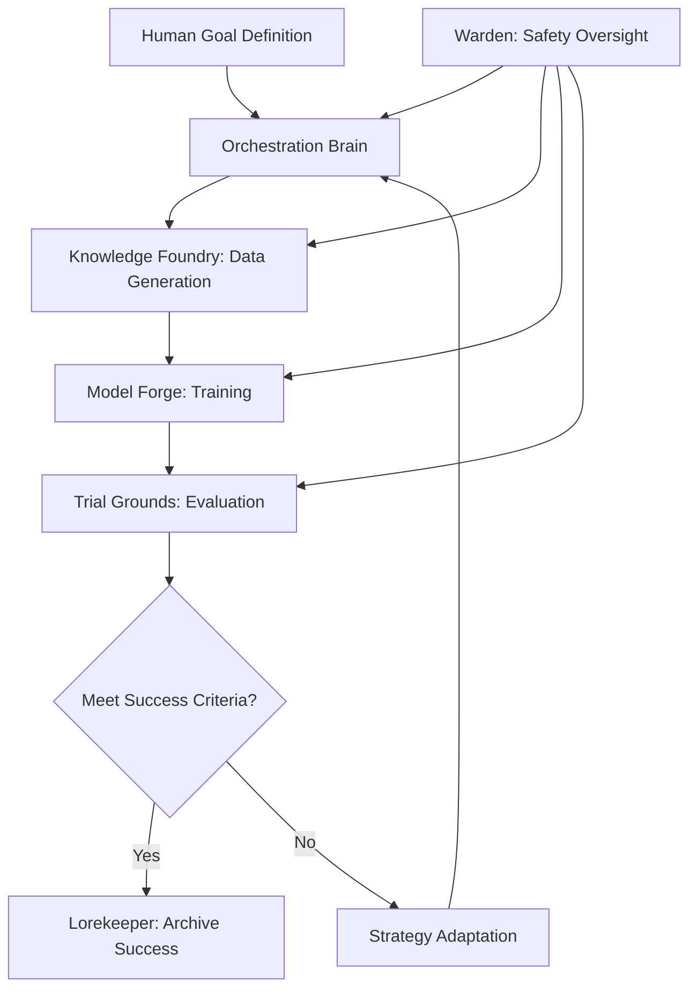

# 🌀 ForgeMind

## Autonomous AI Model Development Platform

**Tagline**: An AI that iteratively designs, trains, and tests its own successors through intelligent meta-learning.

---

## ⚠️ Critical Disclaimer

ForgeMind is an advanced autonomous AI system that generates synthetic data, trains models, and makes strategic decisions with minimal human oversight. This system has the potential for:

- **Unexpected Model Behaviors**: Autonomous iteration can lead to emergent properties not present in the base model
- **Resource Consumption**: Poorly configured loops can consume significant computational resources rapidly  
- **Data Quality Issues**: Synthetic data generation may introduce biases or artifacts that compound over iterations
- **Safety Considerations**: Self-modifying AI systems require robust oversight and safety mechanisms

**By using ForgeMind, you acknowledge these risks and agree to implement appropriate human oversight, safety controls, and resource limits.** This system is designed for experienced ML practitioners and should not be deployed in production without thorough testing and validation.

---

## Table of Contents

1. [The Core Vision](#the-core-vision)
2. [System Architecture](#system-architecture)
3. [Technical Requirements](#technical-requirements)
4. [Quick Start Guide](#quick-start-guide)
5. [Core Components Deep Dive](#core-components-deep-dive)
6. [Development Roadmap](#development-roadmap)
7. [Use Cases & Examples](#use-cases--examples)
8. [Safety & Best Practices](#safety--best-practices)
9. [API Reference](#api-reference)
10. [Contributing](#contributing)

---

## The Core Vision

ForgeMind fundamentally transforms AI model development from a manual, expert-driven process to an autonomous, self-optimizing system. Instead of ML engineers spending weeks iterating on datasets and hyperparameters, ForgeMind creates a closed-loop system that:

### 🎯 Solves the Core Problem

**Traditional ML Development**: Manual data curation → Manual training → Manual evaluation → Manual iteration (weeks/months per cycle)

**ForgeMind Approach**: Autonomous data generation → Intelligent training → Multi-tier evaluation → Strategic adaptation (hours/days per cycle)

### 🔄 The Autonomous Loop



### 🎖️ Key Differentiators

- **Full Autonomy**: End-to-end model development without human intervention per iteration
- **Cost Intelligence**: Built-in budget management and resource optimization  
- **Drift Prevention**: Proactive model collapse detection and mitigation
- **Multi-Objective Optimization**: Balances accuracy, cost, speed, and safety simultaneously
- **Domain Specialization**: Deep vertical integration for specific use cases

---

## System Architecture

ForgeMind is built on six core pillars, each designed for modularity, scalability, and autonomous operation:

### 🧠 Orchestration Brain

**Purpose**: Central decision-making and loop control with intelligent resource management

**Key Capabilities**:

- Multi-objective optimization across accuracy, cost, latency, and safety
- Dynamic budget allocation and real-time cost tracking
- Strategy adaptation based on evaluation feedback
- Parallel experiment coordination
- Human intervention triggers

**Implementation**:

```python
# Core orchestrator interface
class OrchestrationBrain:
    def __init__(self, config: SystemConfig):
        self.budget_manager = BudgetManager(config.max_cost)
        self.strategy_engine = StrategyEngine()
        self.experiment_tracker = ExperimentTracker()
    
    async def execute_iteration(self, goals: GoalSpec) -> IterationResult:
        # Intelligent planning and execution
        pass
```

### 🏭 Knowledge Foundry

**Purpose**: Advanced synthetic and real data generation with quality assurance

**Key Capabilities**:

- Multi-LLM data generation with cross-validation
- Adversarial data creation for robustness
- Real-world data augmentation and integration
- Automated quality filtering and bias detection
- Data provenance tracking for debugging

**Generation Strategies**:

- **Curriculum Learning**: Progressive difficulty scaling
- **Adversarial Generation**: Model A creates examples, Model B validates
- **Domain Expertise Integration**: Structured knowledge incorporation
- **Edge Case Exploration**: Systematic boundary testing

### ⚒️ Model Forge

**Purpose**: Efficient, configurable model training with extensive checkpoint management

**Key Capabilities**:

- LoRA/QLoRA fine-tuning with 4-bit/8-bit precision
- Distributed training across multiple GPUs/nodes
- Intelligent hyperparameter optimization
- Automated early stopping and checkpoint selection
- Training artifact versioning and lineage tracking

**Supported Architectures**:

- LLaMA family (7B, 13B, 70B)
- Mistral/Mixtral models
- CodeLlama variants
- Custom architecture integration via adapters

### 🏟️ Trial Grounds

**Purpose**: Comprehensive, multi-tier evaluation with drift detection

**Evaluation Tiers**:

1. **Canary Tests** (Fast, Low-Cost)
   - Golden dataset drift detection
   - Basic functionality verification
   - Cost: ~$0.10-1.00 per evaluation
   - Runtime: 2-5 minutes

2. **Full Benchmark Suite** (Comprehensive)
   - Domain-specific accuracy metrics
   - Robustness testing across input variations
   - Performance profiling (latency, throughput)
   - Cost: ~$5-20 per evaluation  
   - Runtime: 15-45 minutes

3. **Adversarial Challenges** (Stress Testing)
   - Out-of-distribution robustness
   - Safety boundary testing
   - Jailbreak attempt resistance
   - Cost: ~$10-50 per evaluation
   - Runtime: 30-90 minutes

**Drift Detection Mechanisms**:

- Statistical distribution comparisons
- Embedding space analysis
- Performance metric degradation tracking
- Behavioral consistency monitoring

### 📚 Lorekeeper

**Purpose**: Immutable versioning and comprehensive experiment tracking

**Key Capabilities**:

- Complete experiment lineage tracking
- Artifact versioning (models, datasets, configs)
- Metadata-rich search and querying
- Automated backup and disaster recovery
- Compliance-ready audit trails

**Storage Architecture**:

```
/forge_artifacts/
├── experiments/
│   ├── exp_001/
│   │   ├── config.yaml
│   │   ├── generated_data/
│   │   ├── model_checkpoints/
│   │   ├── evaluation_results/
│   │   └── metadata.json
├── golden_datasets/
├── model_registry/
└── system_logs/
```

### 🛡️ Warden

**Purpose**: Safety, ethics, and human-in-the-loop control center

**Safety Layers**:

1. **Input Validation**: Prompt injection and malicious input detection
2. **Output Filtering**: Harmful content detection and removal
3. **Behavioral Monitoring**: Unexpected model behavior flagging
4. **Resource Limits**: Hard stops for runaway processes
5. **Human Escalation**: Intelligent flagging for expert review

**Active Learning Integration**:

- Uncertainty-based example selection for human labeling
- Strategic human feedback incorporation
- Expert knowledge distillation into the training loop

---

## Technical Requirements

### System Requirements

**Minimum Configuration**:

- Python 3.11+
- CUDA-capable GPU with 16GB+ VRAM (RTX 4090, A4000, etc.)
- 64GB+ System RAM
- 500GB+ NVMe storage
- Stable internet connection for LLM API access

**Recommended Configuration**:

- Python 3.11+
- Multi-GPU setup (2x RTX 4090 or 1x A100/H100)
- 128GB+ System RAM
- 2TB+ NVMe SSD storage
- High-bandwidth internet connection

**Cloud/Cluster Configuration**:

- Kubernetes cluster with GPU node pools
- Distributed storage (S3, GCS, or equivalent)
- Load balancer for API endpoints
- Monitoring infrastructure (Prometheus/Grafana)

### Core Dependencies

```yaml
# Core ML Stack
torch: ">=2.1.0"
transformers: ">=4.35.0"
peft: ">=0.6.0"
bitsandbytes: ">=0.41.0"
accelerate: ">=0.24.0"

# Data Processing
pandas: ">=2.0.0"
datasets: ">=2.14.0"
numpy: ">=1.24.0"

# Orchestration & Workflow
prefect: ">=2.14.0"
ray: ">=2.8.0"  # Optional for distributed training

# Experiment Tracking
mlflow: ">=2.8.0"
wandb: ">=0.16.0"  # Alternative to MLflow

# Data Versioning
dvc: ">=3.30.0"

# Safety & Monitoring
openai: ">=1.3.0"  # For moderation API
detoxify: ">=0.5.0"
evidently: ">=0.4.0"  # For drift detection

# Infrastructure
docker: ">=24.0.0"
kubernetes: ">=1.28.0"  # For cluster deployment
```

### Environment Setup

```bash
# Clone repository
git clone https://github.com/your-org/forgemind.git
cd forgemind

# Create virtual environment
python -m venv forgemind-env
source forgemind-env/bin/activate  # Linux/Mac
# forgemind-env\Scripts\activate     # Windows

# Install dependencies
pip install -r requirements.txt

# Initialize system
python -m forgemind init --config configs/default.yaml
```

---

## Quick Start Guide

### 1. Define Your First Goal

Create a goal specification file:

```yaml
# goals/code_security_review.yaml
task_name: "python_security_assistant"
description: "AI assistant for identifying security vulnerabilities in Python web applications"

# Success Criteria
success_metrics:
  primary: "security_detection_rate >= 0.90"
  secondary: 
    - "false_positive_rate <= 0.05" 
    - "avg_response_time <= 2.0"

# Model Configuration
model_config:
  base_model: "meta-llama/Llama-2-7b-hf"
  training_method: "lora"
  max_sequence_length: 4096
  
# Resource Constraints  
constraints:
  max_budget_per_iteration: 50.0  # USD
  max_total_budget: 500.0         # USD
  max_iterations: 10
  timeout_hours: 24

# Evaluation Setup
evaluation:
  golden_dataset: "datasets/python_security_golden.jsonl"
  benchmark_suite: "security_comprehensive"
  drift_threshold: 0.1
```

### 2. Launch ForgeMind

```python
from forgemind import ForgeMindSystem

# Initialize system
system = ForgeMindSystem.from_config("configs/default.yaml")

# Load goal specification
goal = system.load_goal("goals/code_security_review.yaml")

# Start autonomous development
result = await system.forge(goal)

print(f"Final model: {result.best_model_path}")
print(f"Performance: {result.final_metrics}")
print(f"Total cost: ${result.total_cost:.2f}")
```

### 3. Monitor Progress

```bash
# Launch monitoring dashboard
forgemind dashboard --port 8080

# View real-time logs
forgemind logs --follow --experiment exp_001

# Check resource usage
forgemind status --detailed
```

---

## Core Components Deep Dive

### Orchestration Brain: Intelligent Planning

The Orchestration Brain uses a multi-objective optimization approach to balance competing goals:

```python
class StrategyEngine:
    def __init__(self):
        self.strategies = {
            'data_generation': [
                CurriculumStrategy(),
                AdversarialStrategy(), 
                DiversityStrategy(),
                ExpertKnowledgeStrategy()
            ],
            'training': [
                HyperparameterOptimization(),
                EarlyStoppingStrategy(),
                CheckpointSelection()
            ],
            'evaluation': [
                CanaryFirst(),
                ProgressiveBenchmarking(),
                AdversarialTesting()
            ]
        }
    
    def adapt_strategy(self, iteration_results: List[IterationResult]) -> Strategy:
        # Analyze performance trends
        performance_trend = self.analyze_trend(iteration_results)
        
        if performance_trend == 'plateauing':
            return self.strategies['data_generation'][1]  # Try adversarial
        elif performance_trend == 'overfitting':
            return self.strategies['training'][2]  # Better checkpoint selection
        
        return self.current_strategy
```

### Knowledge Foundry: Advanced Data Generation

The Knowledge Foundry employs multiple complementary strategies:

#### Multi-LLM Cross-Validation

```python
class MultiLLMGenerator:
    def __init__(self, models=['gpt-4', 'claude-3', 'gemini-pro']):
        self.generators = [LLMClient(model) for model in models]
        self.validator = CrossModelValidator()
    
    async def generate_batch(self, prompt: str, n_examples: int) -> List[Example]:
        # Generate from multiple models
        all_examples = []
        for generator in self.generators:
            examples = await generator.generate(prompt, n_examples // len(self.generators))
            all_examples.extend(examples)
        
        # Cross-validate and filter
        validated = self.validator.filter_consensus(all_examples, threshold=0.7)
        return validated
```

#### Curriculum Learning Implementation

```python
class CurriculumGenerator:
    def __init__(self, difficulty_levels=5):
        self.levels = difficulty_levels
        self.current_level = 1
    
    def generate_curriculum_batch(self, base_prompt: str) -> List[Example]:
        # Adjust prompt complexity based on current level
        difficulty_prompt = self.adjust_difficulty(base_prompt, self.current_level)
        
        examples = self.generate_examples(difficulty_prompt)
        
        # Auto-advance curriculum based on model performance
        if self.should_advance_curriculum():
            self.current_level = min(self.current_level + 1, self.levels)
            
        return examples
```

### Model Forge: Efficient Training

#### LoRA Training with Advanced Features

```python
class LoRATrainer:
    def __init__(self, config: TrainingConfig):
        self.config = config
        self.model = self.load_base_model()
        self.peft_config = self.setup_lora_config()
    
    def setup_lora_config(self):
        return LoraConfig(
            r=self.config.lora_rank,
            lora_alpha=self.config.lora_alpha,
            target_modules=["q_proj", "v_proj", "k_proj", "o_proj"],
            lora_dropout=self.config.lora_dropout,
            bias="none",
            task_type=TaskType.CAUSAL_LM,
        )
    
    async def train(self, dataset: Dataset) -> TrainingResult:
        # Setup training with intelligent defaults
        training_args = TrainingArguments(
            output_dir=self.config.output_dir,
            per_device_train_batch_size=self.config.batch_size,
            gradient_accumulation_steps=self.config.grad_accumulation,
            warmup_steps=self.config.warmup_steps,
            learning_rate=self.config.learning_rate,
            fp16=True,  # Enable mixed precision
            logging_steps=10,
            evaluation_strategy="steps",
            eval_steps=self.config.eval_steps,
            save_steps=self.config.save_steps,
            load_best_model_at_end=True,
            metric_for_best_model="eval_loss",
        )
        
        trainer = Trainer(
            model=self.model,
            args=training_args,
            train_dataset=dataset,
            eval_dataset=self.config.eval_dataset,
            tokenizer=self.tokenizer,
            callbacks=[
                EarlyStoppingCallback(early_stopping_patience=3),
                CostTrackingCallback(self.config.budget_manager),
            ]
        )
        
        result = trainer.train()
        return TrainingResult(
            model_path=self.config.output_dir,
            metrics=result.metrics,
            total_cost=self.calculate_training_cost(result)
        )
```

### Trial Grounds: Comprehensive Evaluation

#### Drift Detection Implementation

```python
class DriftDetector:
    def __init__(self, golden_dataset: Dataset):
        self.golden_dataset = golden_dataset
        self.golden_embeddings = self.compute_embeddings(golden_dataset)
        
    def detect_drift(self, model: AutoModel, threshold: float = 0.1) -> DriftReport:
        # Compute embeddings for current model on golden dataset
        current_embeddings = self.compute_embeddings(self.golden_dataset, model)
        
        # Statistical tests for distribution shift
        ks_statistic = self.kolmogorov_smirnov_test(
            self.golden_embeddings, current_embeddings
        )
        
        # Cosine similarity analysis
        similarity_shift = self.cosine_similarity_shift(
            self.golden_embeddings, current_embeddings
        )
        
        # Performance degradation check
        performance_metrics = self.evaluate_on_golden(model)
        baseline_metrics = self.load_baseline_metrics()
        
        performance_drift = self.calculate_performance_drift(
            baseline_metrics, performance_metrics
        )
        
        drift_detected = (
            ks_statistic > threshold or 
            similarity_shift > threshold or 
            performance_drift > threshold
        )
        
        return DriftReport(
            drift_detected=drift_detected,
            ks_statistic=ks_statistic,
            similarity_shift=similarity_shift,
            performance_drift=performance_drift,
            recommendations=self.generate_recommendations(drift_detected)
        )
```

---

## Development Roadmap

### Phase 1: Core Loop (Months 1-3)

**Status**: 🟡 In Progress

**Deliverables**:

- [ ] Basic orchestration loop (generate → train → evaluate → adapt)
- [ ] LoRA fine-tuning integration
- [ ] Simple synthetic data generation  
- [ ] Cost tracking and budget enforcement
- [ ] Basic drift detection on golden datasets
- [ ] CLI interface and configuration system

**Success Criteria**:

- Complete 3 autonomous iterations on a simple task
- Demonstrate improvement trend within $150 budget
- Achieve <10% drift on golden dataset

### Phase 2: Safety & Production Readiness (Months 4-5)

**Status**: 🔴 Planned

**Deliverables**:

- [ ] Comprehensive safety filtering (Warden implementation)
- [ ] Human-in-the-loop integration points
- [ ] Advanced drift detection with multiple statistical tests
- [ ] Model and dataset versioning system (Lorekeeper)
- [ ] Web dashboard for monitoring and control
- [ ] Docker containerization and basic cloud deployment

**Success Criteria**:

- Pass safety audit on generated content (0% harmful outputs)
- Successfully recover from 5 different failure scenarios
- Deploy to cloud environment with <99.9% uptime

### Phase 3: Advanced Intelligence (Months 6-8)

**Status**: 🔴 Planned

**Deliverables**:

- [ ] Multi-LLM data generation with cross-validation
- [ ] Curriculum learning implementation
- [ ] Active learning with human expert feedback
- [ ] Parallel experiment execution
- [ ] Advanced strategy adaptation algorithms
- [ ] Integration with external data sources

**Success Criteria**:

- Achieve 25% better sample efficiency vs. Phase 1
- Successfully handle 3 different domain verticals
- Demonstrate human expert integration improving results by >15%

### Phase 4: Scale & Optimization (Months 9-12)

**Status**: 🔴 Planned

**Deliverables**:

- [ ] Distributed training across multiple nodes
- [ ] Advanced multi-objective optimization
- [ ] Production-grade API and SDK
- [ ] Enterprise security and compliance features
- [ ] Advanced analytics and reporting
- [ ] Multi-modal model support (vision, audio)

**Success Criteria**:

- Support 100+ concurrent experiments
- Achieve <$0.50 per high-quality model iteration
- Deploy in enterprise environment with full compliance

---

## Use Cases & Examples

### 1. Code Security Assistant

**Domain**: Cybersecurity / DevSecOps  
**Goal**: Build an AI assistant that identifies security vulnerabilities in Python web applications

```yaml
# Security-focused goal configuration
task_name: "python_security_scanner"
base_model: "codellama/CodeLlama-7b-Python-hf"

success_metrics:
  security_detection_rate: ">= 0.92"
  false_positive_rate: "<= 0.08"
  code_understanding_score: ">= 0.85"

data_generation:
  strategies:
    - "vulnerable_code_patterns"
    - "secure_code_examples"  
    - "exploit_demonstrations"
    - "remediation_suggestions"
  
  sources:
    - cve_database: "nvd.nist.gov"
    - code_repositories: ["owasp", "security-focused"]
    - expert_knowledge: "security_expert_prompts.yaml"

evaluation:
  golden_dataset: "owasp_top10_test_cases.jsonl"
  benchmarks:
    - "cwe_detection_suite"
    - "penetration_test_scenarios" 
    - "false_positive_minimization"
```

**Expected Outcome**:

- 90%+ detection of common vulnerabilities (SQL injection, XSS, etc.)
- <5% false positives on clean code
- Real-time analysis capability (<2 seconds per file)
- Total development cost: ~$200-400

### 2. Legal Document Analysis

**Domain**: Legal Technology  
**Goal**: Create an AI that can analyze contracts for specific clause types and risks

```yaml
task_name: "contract_risk_analyzer"
base_model: "meta-llama/Llama-2-13b-hf"

success_metrics:
  clause_identification_accuracy: ">= 0.88"
  risk_assessment_correlation: ">= 0.80"  # vs. human lawyers
  processing_speed: ">= 100 pages/hour"

data_generation:
  strategies:
    - "contract_clause_extraction"
    - "risk_scenario_simulation"
    - "legal_precedent_integration"
  
  domain_knowledge:
    - contract_types: ["employment", "vendor", "partnership", "licensing"]
    - risk_categories: ["liability", "termination", "intellectual_property"]
    - jurisdictions: ["us_federal", "california", "new_york"]

constraints:
  max_budget_per_iteration: 100.0
  privacy_requirements: "pii_scrubbing_required"
  compliance: ["gdpr", "attorney_client_privilege"]
```

### 3. Financial Fraud Detection

**Domain**: FinTech / Banking  
**Goal**: Develop a model that identifies potentially fraudulent financial transactions

```yaml
task_name: "transaction_fraud_detector"
base_model: "microsoft/DialoGPT-medium"  # For conversational analysis

success_metrics:
  fraud_detection_rate: ">= 0.94"
  false_positive_rate: "<= 0.02"  # Critical for customer experience
  real_time_processing: "<= 50ms per transaction"

data_generation:
  strategies:
    - "synthetic_transaction_patterns"
    - "anomaly_injection_scenarios"
    - "behavioral_pattern_simulation"
  
  privacy_protection:
    - differential_privacy: true
    - data_anonymization: "k_anonymity_5"
    - synthetic_data_only: true  # No real financial data

evaluation:
  benchmarks:
    - "synthetic_fraud_scenarios"  
    - "adversarial_evasion_tests"
    - "fairness_bias_detection"
  
  drift_monitoring:
    - "transaction_pattern_shifts"
    - "seasonal_behavior_changes"
    - "new_fraud_technique_emergence"
```

---

## Safety & Best Practices

### Essential Safety Principles

#### 1. Human Oversight Requirements

- **Never run unsupervised in production**: Always maintain human monitoring capability
- **Budget hard limits**: Implement non-overridable cost controls
- **Emergency stop mechanisms**: Provide immediate system shutdown capabilities  
- **Regular safety audits**: Schedule periodic human review of generated content and model behavior

#### 2. Data Quality Assurance

```python
# Implement robust data validation
class DataQualityChecker:
    def validate_batch(self, examples: List[Example]) -> ValidationReport:
        checks = [
            self.check_toxicity(examples),
            self.check_bias_indicators(examples),
            self.check_factual_consistency(examples),
            self.check_privacy_leakage(examples),
            self.check_adversarial_patterns(examples)
        ]
        
        return ValidationReport(
            passed=all(check.passed for check in checks),
            issues=self.aggregate_issues(checks),
            recommendations=self.generate_safety_recommendations(checks)
        )
```

#### 3. Resource Protection

```yaml
# Mandatory resource limits
resource_limits:
  max_gpu_hours_per_day: 24
  max_api_calls_per_hour: 1000
  max_storage_gb: 500
  emergency_stop_conditions:
    - cost_per_hour_exceeds: 50.0
    - memory_usage_exceeds: "90%"
    - error_rate_exceeds: 0.1
```

#### 4. Model Behavior Monitoring

- **Behavioral drift detection**: Monitor for unexpected changes in model outputs
- **Adversarial testing**: Regular probing for jailbreaking or manipulation
- **Output filtering**: Real-time content safety checks on all generated text
- **Audit logging**: Complete traceability of all model decisions and adaptations

### Production Deployment Checklist

#### Pre-Deployment

- [ ] Complete safety audit of all generated content over 100+ iterations
- [ ] Stress test with 10x expected load
- [ ] Verify all emergency stop mechanisms function correctly
- [ ] Establish monitoring dashboards and alerting systems
- [ ] Create incident response playbook
- [ ] Train operations team on ForgeMind-specific procedures

#### Security Configuration

```yaml
# Production security settings
security:
  enable_content_filtering: true
  content_filters: ["toxicity", "pii", "bias", "harmful_instructions"]
  
  human_review_triggers:
    - confidence_below: 0.7
    - novel_pattern_detected: true
    - safety_score_below: 0.9
    - drift_detected: true
  
  access_controls:
    admin_users: ["user1@company.com"]
    read_only_users: ["analyst@company.com"]
    api_rate_limits:
      requests_per_minute: 100
      concurrent_experiments: 5
```

#### Monitoring & Alerting

```python
# Critical alerts configuration
alerts = {
    'budget_exceeded': {
        'threshold': '80% of monthly budget',
        'severity': 'high',
        'notification': 'immediate_email_and_slack'
    },
    'drift_detected': {
        'threshold': '> 0.15 drift score',
        'severity': 'medium', 
        'notification': 'email_within_1hour'
    },
    'safety_violation': {
        'threshold': 'any harmful content detected',
        'severity': 'critical',
        'notification': 'immediate_page_and_stop_system'
    }
}
```

---

## API Reference

### Core System API

#### System Initialization

```python
from forgemind import ForgeMindSystem, GoalSpec, SystemConfig

# Initialize with configuration
config = SystemConfig.from_file("config.yaml")
system = ForgeMindSystem(config)

# Health check
status = await system.health_check()
```

#### Goal Management

```python
# Create goal specification
goal = GoalSpec(
    task_name="custom_model",
    base_model="meta-llama/Llama-2-7b-hf",
    success_metrics={"accuracy": ">= 0.85"},
    constraints={"max_budget": 100.0}
)

# Start autonomous development
result = await system.forge(goal)

# Monitor progress
async for update in system.stream_progress(result.experiment_id):
    print(f"Iteration {update.iteration}: {update.metrics}")
```

#### Experiment Management

```python
# List experiments
experiments = await system.list_experiments()

# Get detailed results
experiment = await system.get_experiment("exp_001")
print(f"Status: {experiment.status}")
print(f"Best model: {experiment.best_model_path}")
print(f"Total cost: ${experiment.total_cost}")

# Stop running experiment
await system.stop_experiment("exp_001")
```

### Advanced Configuration

#### Custom Strategy Implementation

```python
from forgemind.strategies import DataGenerationStrategy

class CustomDomainStrategy(DataGenerationStrategy):
    def __init__(self, domain_knowledge: dict):
        self.domain_knowledge = domain_knowledge
        
    async def generate_batch(self, prompt: str, n_examples: int) -> List[Example]:
        # Custom generation logic
        enhanced_prompt = self.enhance_with_domain_knowledge(prompt)
        return await self.base_generate(enhanced_prompt, n_examples)
        
    def enhance_with_domain_knowledge(self, prompt: str) -> str:
        # Inject domain-specific context
        return f"{prompt}\n\nDomain Context: {self.domain_knowledge}"

# Register custom strategy
system.register_strategy("custom_domain", CustomDomainStrategy(domain_data))
```

#### Custom Evaluation Metrics

```python
from forgemind.evaluation import EvaluationMetric

class CustomSecurityMetric(EvaluationMetric):
    name = "security_vulnerability_detection"
    
    def evaluate(self, model_outputs: List[str], ground_truth: List[str]) -> float:
        # Implement custom security-focused evaluation
        vulnerabilities_found = self.count_vulnerabilities_detected(
            model_outputs, ground_truth
        )
        total_vulnerabilities = len(ground_truth)
        return vulnerabilities_found / total_vulnerabilities
    
    def count_vulnerabilities_detected(self, outputs: List[str], truth: List[str]) -> int:
        # Custom vulnerability detection logic
        return sum(1 for out, true in zip(outputs, truth) if self.matches_vulnerability(out, true))

# Register custom metric
system.register_metric(CustomSecurityMetric())
```

### CLI Interface

```bash
# Initialize new project
forgemind init --template security_assistant

# Start autonomous development
forgemind forge --goal goals/security_review.yaml --background

# Monitor running experiments
forgemind status --detailed
forgemind logs --experiment exp_001 --follow

# Manage experiments
forgemind list-experiments
forgemind stop-experiment exp_001
forgemind archive-experiment exp_001

# System utilities
forgemind validate-config config.yaml
forgemind test-connection --api openai
forgemind export-results exp_001 --format json
```

---

## Contributing

We welcome contributions that advance ForgeMind's capabilities in autonomous AI development. Here's how to get involved:

### Development Setup

```bash
# Fork and clone the repository
git clone https://github.com/your-username/forgemind.git
cd forgemind

# Install development dependencies
pip install -e ".[dev]"
